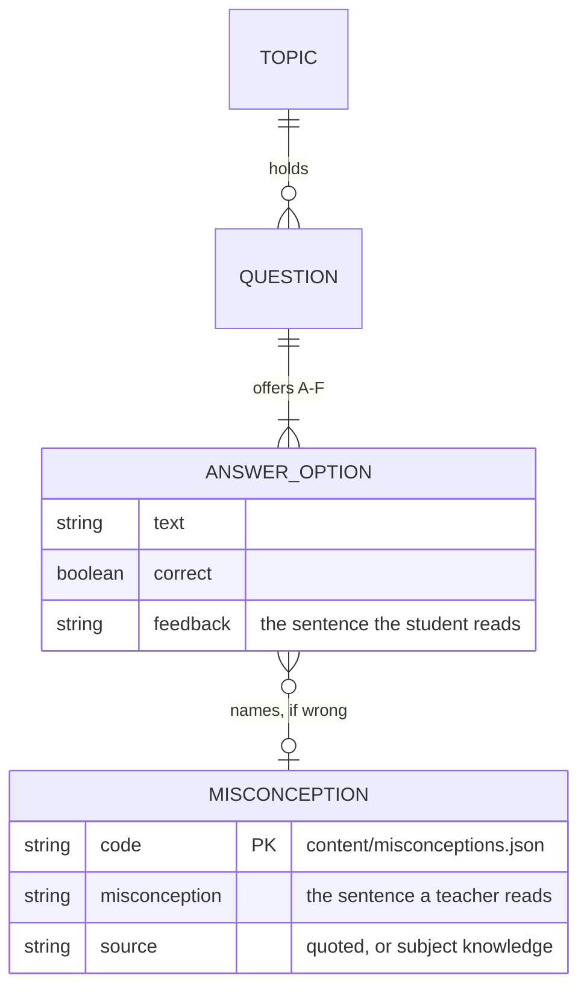

# Maths practice app

Multiple-choice maths practice for secondary school students, plus a teacher-facing editable
question bank. Finishing a set is gamified with a Minecraft-themed mining game.

---

## The core user experience and value

The student answers short sets of questions pitched at their level, covering the DfE's Year 7–8 Key
Stage 3 units. Each wrong answer names the misconception behind it, drawn from the register
([`content/misconceptions.json`](content/misconceptions.json)), rather than just "incorrect".
Finishing pays points, a streak and play time.

---

## Stack

| | |
|---|---|
| Backend | Spring Boot 3.5, Java 21, Spring Data JPA, Spring Security, JWT |
| Database | SQLite, one file, no server. Schema by Flyway |
| Frontend | React 19, TypeScript, Vite, Tailwind CSS v4, React Router |
| Tests | JUnit 5 + Mockito (**155**) · Vitest (**104**) |
| Deploy | GitHub Actions → GHCR → one Lightsail instance, Caddy in front |

---

## Running it locally

```bash
cd backend  && REALMATHS_GOOGLE_CLIENT_ID=<client-id> mvn spring-boot:run   # API on :8081
cd frontend && npm install && VITE_GOOGLE_CLIENT_ID=<client-id> npm run dev # web on :5174
```

Or in Docker: `docker compose up --build` (API + SQLite volume, port 8081).

Open <http://localhost:5174>. **Both** variables are needed and hold the same value: the frontend
one renders Google's button, the API one checks the token's `aud`. Missing frontend → "not
configured for this build"; missing API → sign-in fails with 503 *after* Google has already issued
a token. The client ID is public, not a secret.

**Stay on 5174** — it is the only origin registered on the OAuth client, and `vite.config.ts` pins
it with `strictPort`. A second worktree can pass `--port` and register that origin; do not edit the
file (`docs/google-signin.md`). The API is proxied through Vite, so there is no CORS;
`VITE_API_URL` overrides the target.

The database is created at `backend/data/realmaths.db` on first run. To reset, delete it and its
`-wal`/`-shm` siblings — **this drops every account and role**. Sign in again (you come back as
`STUDENT`), then `./scripts/make-admin.sh <your email>`; `scripts/dev-reset.sh` does both.

**Renaming or deleting a migration needs `mvn clean`** — Maven never removes stale copies from
`target/classes`, so a deleted migration keeps running. `mvn clean test` is the reliable check.

---

## Tests

```bash
cd backend  && mvn test       # 155 tests
cd frontend && npm test       # 104 tests
cd frontend && npm run build  # runs tsc --noEmit as well, so type errors fail the build
```

Two tests cover things nothing else can. `db/SchemaMigrationTest` applies the real migrations to a
temporary SQLite file and asserts the schema guarantees directly — Hibernate's community SQLite
dialect cannot reliably do `ddl-auto=validate`. `auth/AuthWiringTest` boots the whole application
context and asserts there is **exactly one** `JwtDecoder` bean.

There are no component tests: the frontend suite has no DOM environment. Logic worth asserting
lives in plain functions (`auth/roles.ts`, `lib/format.ts`, `lib/playtime.ts`, `lib/platformer.ts`).

---

## API

Authenticated requests use `Authorization: Bearer <token>`. The token is ours, issued by
`JwtService`; it is not Google's.

| Method | Path | Purpose |
|---|---|---|
| POST | `/api/auth/google` | Exchange a Google ID token for ours |
| POST | `/api/auth/guest` | Create a throwaway student account |
| GET | `/api/topics` | Topics with published question counts. Optional `yearGroup` counts one year and drops empty topics |
| POST | `/api/quiz/sessions` | Deal a quiz (`topicSlug` optional, `count`, `yearGroup` optional) |
| GET | `/api/quiz/sessions/{id}` | A session with its answers so far |
| POST | `/api/quiz/sessions/{id}/answers` | Submit one answer, returns the grade |
| POST | `/api/quiz/sessions/{id}/complete` | Finish, returns the full review |
| GET | `/api/me` | Profile with statistics |
| PATCH | `/api/me` | Change display name |
| GET | `/api/me/history` | Completed quizzes |
| GET | `/api/game` | Play-time balance, without spending it |
| POST | `/api/game/heartbeat` | "Still playing": bills the time since the last call |
| GET | `/api/admin/questions` | Paged question list. Filters: `topicId`, `status`, `difficulty`, `origin`, `yearGroup`, `q` |
| POST | `/api/admin/questions` | Create a draft |
| GET | `/api/admin/questions/{id}` | One question, **with the answer key** |
| PUT | `/api/admin/questions/{id}` | Replace a question and its options |
| POST | `/api/admin/questions/{id}/publish` | Validate, then make it live |
| POST | `/api/admin/questions/{id}/retire` | Take it out of circulation |
| GET/POST/PUT | `/api/admin/topics` | List, create and edit topics |

Everything under `/api/admin/**` requires `ROLE_ADMIN`, enforced in `SecurityConfig` by path
prefix rather than per controller, so a new endpoint is protected by where it lives.
`AdminApiTest` asserts a student is refused, so a route mounted outside the prefix fails the build.

---

## The misconception register

This is the heart of the business logic. Topics hold questions; questions offer answer options; a
wrong option carries two things. A `misconception_code` names the error it was written to catch,
and `feedback` is the sentence the student reads when they pick it. What the student is told hangs
on the **option**, not on the code, because the option is what knows which misreading was actually
made: on "what is the value of the 2 in 5.320?", 0.2 and 0.002 are different errors that catch the
same code. Across the bank that is 508 wrong options and 508 messages, each written to that option.

The vocabulary is [`content/misconceptions.json`](content/misconceptions.json), the register: 131
rows, each with the code, its topic, the sentence a **teacher** reads, an example, and a source —
quoted from the DfE/NCETM guidance, or recorded as standard subject knowledge where the guidance is
silent. It is a content file rather than a table: only the code is stored against an option, and
`render.py --check` refuses a bank whose option names a code the register does not have. Nothing in
the register reaches a student; the register is how a teacher and the bank agree on what an error is
called.



Saving is still loose — a draft may be half-written — but publishing an option that names an error
without saying what the student thought is refused in `QuestionValidator`, so a distractor cannot
go live naming a problem and explaining nothing.

The rest, briefly:

- **The answer key never leaves the server.** Students get DTOs with no correctness field; grading
  happens in `QuizService`. Only the admin DTOs carry the key. A `DRAFT`→`PUBLISHED` gate means a
  draft may be invalid, and nothing is hard-deleted — retiring is the only removal, because
  `quiz_answers` would cascade away with it.
- **One grading rule for both answer types.** The chosen set must equal the correct set, so a
  single-choice question is just the one-member case; there is no partial credit.
- **The year group is the student's choice, not a fact about them.** Nothing about it is stored on
  the account, and a Year 7 can pick Year 10.
- **Play time is metered server-side** by heartbeats, so editing the bundle cannot mint it.
- **Sign-in is Google or a guest account** — there are no passwords — and identity is keyed on
  `(provider, subject)`, never on mutable email.

---

## How it is deployed

One Lightsail instance, one small Docker Compose stack, Caddy in front. SQLite is a file in a
volume on that instance. No load balancer, no managed database, nothing serverless.

```
push to main
   │
   ├─ test    reuses ci.yml: backend tests, frontend tests, typecheck and build
   ├─ infra   terraform apply, state in S3        ─┐ both need the test job
   ├─ build   docker images → ghcr.io             ─┘ to pass
   └─ deploy  ssh to the instance, update .env, docker compose up, smoke test
```

Runs are serialised by a `concurrency` group, so two pushes queue rather than racing for the host
or the Terraform state.

| | |
|---|---|
| Host | `maths.thinktalkbuild.com` → static IP `16.60.38.27`, Lightsail, `eu-west-2` |
| Instance | `realmaths`, Ubuntu 24.04 |
| On the host | `/srv/realmaths/` — `.env`, `docker-compose.prod.yml`, `Caddyfile` |
| Database | volume `realmaths_realmaths-data`, at `/data/realmaths.db` in the api container |
| Images | `ghcr.io/katesant/real-maths/api` and `/web` |
| Terraform state | `s3://realmaths-terraform-state-991346485322` |
| CI role | `realmaths-github-ci`, assumed over GitHub OIDC — no stored AWS keys |

Repository **variables** (not secrets): `SITE_DOMAIN`, `GOOGLE_CLIENT_ID`, `AWS_REGION`,
`AWS_AVAILABILITY_ZONE`, `SSH_CIDR`, `SSH_PUBLIC_KEY`, `TF_STATE_BUCKET`. Secrets: `AWS_ROLE_ARN`,
`DEPLOY_USER`, `DEPLOY_HOST_KEY`, `DEPLOY_SSH_KEY`. There is one environment, `production`.

`VITE_GOOGLE_CLIENT_ID` reaches the web image as a **Docker build arg**, not a runtime variable,
because Vite inlines it. Setting it on the container does nothing. The deploy step upserts new keys
into the host's `.env` rather than `sed`-replacing them, because `sed` does nothing at all when a
key is absent — which is how `REALMATHS_GOOGLE_CLIENT_ID` first shipped missing while the deploy
reported success.

After deploying, the smoke test checks `GET /` returns 200 (Caddy and the certificate are up),
`GET /api/topics` returns 401 (the API is reachable and refusing anonymous callers), and
`POST /api/auth/google` with a junk token returns **401, not 503** — 503 means the API has no
client ID, which is otherwise invisible because the button still renders and Google still issues a
token.

The `realmaths-github-ci` role trusts `repo:KateSant@*/real-maths@*:...`, so only this repository's
workflows can assume it over OIDC.

### Operating it

```bash
# logs
ssh -i ~/.ssh/realmaths-deploy ubuntu@16.60.38.27 \
  'cd /srv/realmaths && docker compose -f docker-compose.prod.yml logs -f api'
```

For a database check, query a copy rather than the live volume — SQLite has to write the `-shm`
file to read a WAL database, so a `:ro` mount fails rather than protecting anything.

```bash
# a read-only check: query a copy, so the live volume is never opened for writing
ssh -i ~/.ssh/realmaths-deploy ubuntu@16.60.38.27 '
  d=$(mktemp -d)
  docker cp realmaths-api-1:/data/realmaths.db "$d/" >/dev/null
  docker cp realmaths-api-1:/data/realmaths.db-wal "$d/" >/dev/null 2>&1
  python3 -c "import sqlite3,sys; [print(r) for r in sqlite3.connect(sys.argv[1]).execute(sys.argv[2])]" \
    "$d/realmaths.db" \
    "select u.email,u.role,i.last_login_at from users u left join user_identities i on i.user_id=u.id"
  rm -rf "$d"'
```

A pre-migration backup of the production database is at `/home/ubuntu/realmaths-before-v4.db` on
the host, taken before `V4` ran. Take another before any future migration:

```bash
docker run --rm -v realmaths_realmaths-data:/data -v /home/ubuntu:/backup alpine:3 sh -c \
  'apk add --no-cache sqlite >/dev/null && sqlite3 /data/realmaths.db ".backup /backup/realmaths-$(date +%F).db"'
```

`.backup` rather than `cp`, so anything still in the WAL is included.

---

## Working on this repository

**More than one agent may be working here at once. Use a `git worktree`, not a second checkout of
the same directory.**

```bash
git worktree add -b my-branch ../my-worktree main
```

Two agents in one working directory caused a real incident: one ran `git add -A` and swept up the
other's in-progress files, which broke the build on `main` and blocked a deploy. **Never use
`git add -A` here** — stage explicit paths. A worktree also keeps uncommitted work in one branch
away from the other's.

Other things that have actually gone wrong, so worth checking first:

| Symptom | Cause |
|---|---|
| "Google sign-in is not configured for this build" | `VITE_GOOGLE_CLIENT_ID` missing when the dev server started. Vite inlines it at startup; the API cannot supply it. |
| "Google sign-in is not configured on this server" (503) | `REALMATHS_GOOGLE_CLIENT_ID` missing from the API. |
| Sign-in silently does nothing on click | The page's origin is not registered on the OAuth client, or the dev server is on a different port than the config expects. See the port rule under "Running it locally". |
| Two dev servers fighting over 5174 | `strictPort` means the second one fails loudly rather than moving. A second worktree can use `--port 5173`, but Google sign-in will not work there until that origin is registered on the OAuth client. **Do not fix this by editing the port in `frontend/vite.config.ts`** — that is what breaks sign-in for everyone. |
| An edited question 404s | It has no options yet, and a query used an inner join. Fixed, but a reminder that a draft may be empty. |
| `{}` in a component | JSX syntax interpolating a value. It is not text on the page. |

---

## Parked work

See `docs/deferred.md`. It covers publishing the Google OAuth app, the missing privacy policy,
case-insensitive email uniqueness, guest accounts losing their progress on signing in, and the
untested admin screens.
